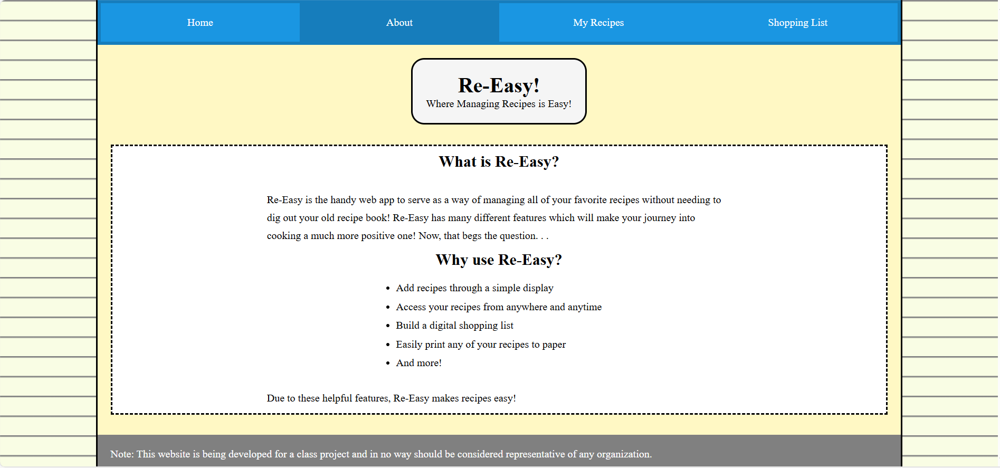
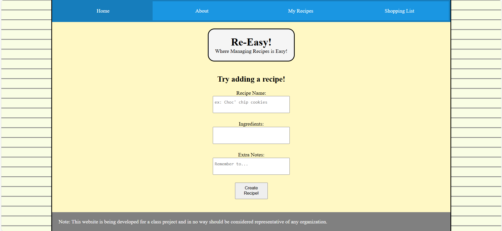

# Notes on current pages / features:

-Added call to zen quotes api
-Sessions now persist (i.e. can refresh without being logged out)
-Fixed some issues with responsiveness, but work is still needed

Note: Whether or not there is a deliverable next week, I am going to fix some of
      the following TBD items.

#### To Do Next:

-Find alternative to alert messages, or toastify (ran into issues)
-Make page more responsive
-Decorate myRecipes page, possibly add an image for each recipe
-Make clicking on a recipe open an info page with recipe ingredients and steps

# Week 11 features below!

-Added the ability to create an account
-Passwords and email must fit certain criteria
-Can verify your account by clicking on email link
-Able to log into app and view your personal recipes

# Week 10 features below!

-Added a quantity box on the shoppingList page as requested
-Adding recipes is now functional
-Viewing names of your recipes now works too
Note: the user is hardcoded as user_id = 2, temporarily but it will be dynamic

##### Row-level-Security:
I feel that one of the most beneficial uses for row-level security would be
to only allow users to view recipes associated with their id. While it is implemented on
the client side to only view those, it doesn't necessarily make it entirely secure yet. I feel
this would definitely be a priority in the near future when I implement some level of RLS.


# Week 9 features below!

I centered the tagline in the website to make it more uniform with the
content itself. I also ensured that all inputs are associated with a label, as well as
giving the form's submit button the attribute: type="submit".

-Also updated the general styling to reflect a notebook look in the website.
-Changed some of the coloring to make it less harsh to look at.
-Added borders to certain elements to add more dimension to the page

Note: my-recipes page is still not implemented, but it will be when the database is integrated as
      the page relies heavily on it being present.

Screenshots:



# Week 8 features below!

-home-page.ejs      Notifies user of valid or invalid values for a new recipe(name, ingredients or notes)

-shopping-list.ejs  Allows user to add new items to the list, although db will be required for 
                    further functionality

-Other: *Replaced old routes with route js files, as well as controllers for every page in the website
        *Added styles for buttons to sort of match their functionality (red -> delete, green -> add)


# Week 7 features below!

-home-page.ejs     Shows what entries to add a recipe may look like

-about.ejs         QnA section that addresses some questions and explains the future features

-shopping-list.ejs    Shows the checklist layout for a sample shopping list

-my-recipes.ejs     To be implemented after getting further into the project

# Important note:

There may be leftover files from the template, but those can be ignored as they are not in use anymore


# Template notes below this point
------------------------------------------------------------------------------------------------------

# CS346 Project Template Documentation

## Overview

This is a teaching template for building web applications with:
- **Node.js 20**: JavaScript runtime
- **Express 4**: Web application framework
- **EJS**: Templating engine
- **PostgreSQL**: Relational database
- **Vanilla JavaScript**: Client-side scripting (no frameworks)

## Security Features

- **Helmet**: Sets security-related HTTP headers
- **express-session**: Secure session management
- **CSRF Protection**: Cross-Site Request Forgery protection
- **Parameterized SQL Queries**: SQL injection prevention

## Project Structure

```
.
├── src/
│   ├── server.js           # Server entry point
│   ├── app.js              # Express app configuration
│   ├── routes/             # Route definitions
│   │   ├── index.js        # Main routes
│   │   └── users.js        # User routes
│   ├── controllers/        # Request handlers
│   │   ├── indexController.js
│   │   └── userController.js
│   ├── models/             # Database models
│   │   ├── db.js           # Database connection
│   │   └── User.js         # User model
│   ├── views/              # EJS templates
│   │   ├── index.ejs       # Home page
│   │   ├── error.ejs       # Error page
│   │   └── layout.ejs      # Layout template (optional)
│   └── public/             # Static files
│       ├── css/
│       │   └── style.css   # Stylesheet
│       └── js/
│           └── main.js     # Client-side JavaScript
├── db/
│   ├── migrate.js          # Migration runner
│   ├── seed.js             # Seed runner
│   ├── reset.js            # Database reset script
│   ├── migrations/         # Database migrations
│   │   └── 001_create_users_table.sql
│   └── seeds/              # Database seeds
│       └── 001_seed_users.sql
├── docs/                   # Documentation
│   ├── README.md           # This file
│   ├── SETUP.md            # Setup instructions
│   └── ARCHITECTURE.md     # Architecture overview
├── .env.example            # Environment variables template
├── .eslintrc.json          # ESLint configuration
├── .prettierrc.json        # Prettier configuration
├── .gitignore              # Git ignore rules
├── package.json            # Project dependencies and scripts
└── README.md               # Project README
```

## Getting Started

See [SETUP.md](./SETUP.md) for detailed setup instructions.

## Architecture

See [ARCHITECTURE.md](./ARCHITECTURE.md) for detailed architecture information.

## Development

### Available Scripts

- `npm start`: Start the production server
- `npm run dev`: Start the development server with auto-reload
- `npm run migrate`: Run database migrations
- `npm run seed`: Seed the database with sample data
- `npm run reset`: Reset the database (drop all tables and re-run migrations and seeds)
- `npm run lint`: Check code for linting errors
- `npm run lint:fix`: Fix linting errors automatically
- `npm run format`: Format code with Prettier

### Code Style

This project uses:
- **ESLint** for JavaScript linting
- **Prettier** for code formatting

Run `npm run lint` to check for issues and `npm run format` to format your code.

## Security Best Practices

1. **Environment Variables**: Never commit `.env` file. Use `.env.example` as a template.
2. **Password Hashing**: Always hash passwords using bcrypt before storing.
3. **Input Validation**: Validate and sanitize all user input.
4. **SQL Injection**: Use parameterized queries ($1, $2, etc.) for all database operations.
5. **CSRF Protection**: Include CSRF tokens in all forms.
6. **Session Security**: Use secure, httpOnly cookies in production.

## Database Operations

### Migrations

Migrations are SQL files in `db/migrations/` that create or modify database tables.

To create a new migration:
1. Create a new file: `db/migrations/00X_description.sql`
2. Write your SQL (CREATE TABLE, ALTER TABLE, etc.)
3. Run `npm run migrate`

### Seeds

Seeds are SQL files in `db/seeds/` that populate the database with initial or test data.

To create a new seed:
1. Create a new file: `db/seeds/00X_description.sql`
2. Write your INSERT statements
3. Run `npm run seed`

### Parameterized Queries

Always use parameterized queries to prevent SQL injection:

```javascript
// ❌ Bad (SQL injection vulnerable)
const result = await db.query(`SELECT * FROM users WHERE email = '${email}'`);

// ✅ Good (parameterized)
const result = await db.query('SELECT * FROM users WHERE email = $1', [email]);
```

## Contributing

When contributing to this project:
1. Follow the existing code style
2. Run `npm run lint` before committing
3. Test your changes thoroughly
4. Update documentation as needed

## Resources

- [Express.js Documentation](https://expressjs.com/)
- [EJS Documentation](https://ejs.co/)
- [PostgreSQL Documentation](https://www.postgresql.org/docs/)
- [Node.js Documentation](https://nodejs.org/docs/)
- [Helmet Documentation](https://helmetjs.github.io/)
